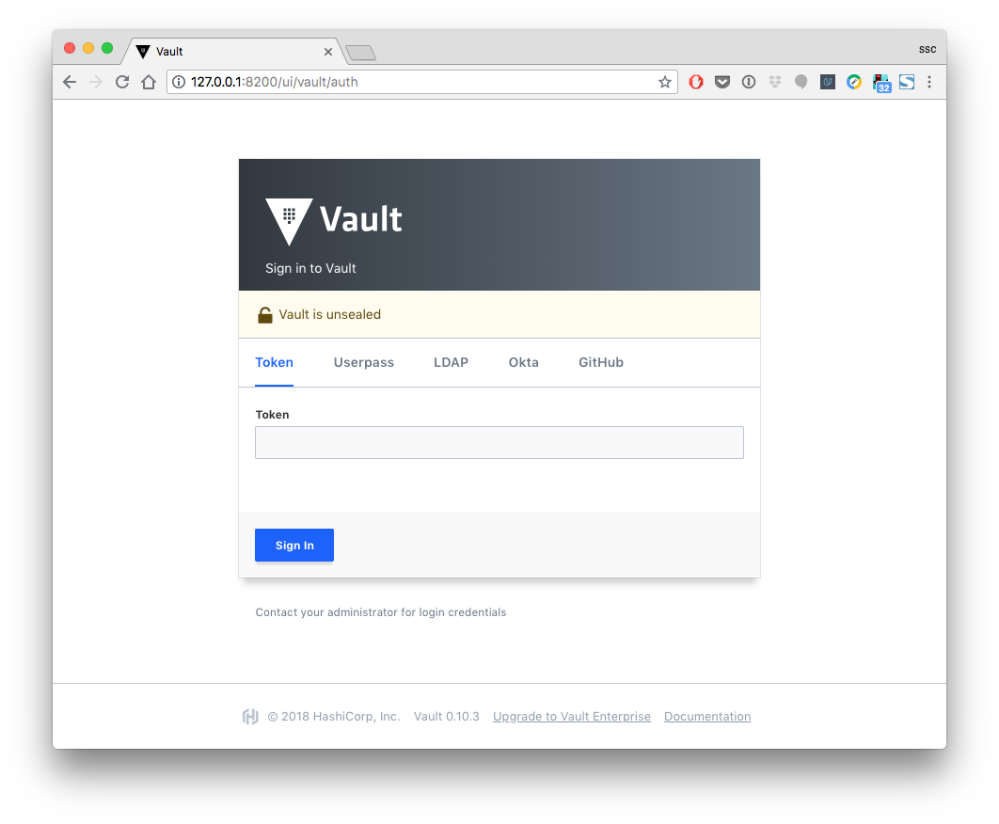

# VaultTools

A [DesmoDyne](https://www.desmodyne.com) project that provides tools focussed on working with [HashiCorp Vault](https://www.vaultproject.io) as a secrets management solution.

The tools in this project aim to provide support for container-based software development. They are mostly targeted at macOS, but are intended to work cross-platform, so they might also be usable on Linux (or other *nixes), possibly with minor modifications.

Relevant links:

+ [gitlab project repository](https://gitlab.com/DesmoDyne/Tools/VaultTools)

## Getting started

### Clone this repository

+ create a shell / Terminal session
+ sample shell prompt in this document is default macOS 10.12 bash, YMMV
+ `"mkcd"`: <https://unix.stackexchange.com/a/219627>

```
hostname:~ username$ mkdir -p ~/Temp/test_vault && cd $_
hostname:test_vault username$ git clone https://gitlab.com/DesmoDyne/Tools/VaultTools.git
  ...
```

### Run Docker container composition

```
hostname:test_vault username$ cd vault/code/docker/cc-vault_docker_hub
hostname:cc-vault_docker_hub username$ docker-compose up
  ...
```

### Inspect containers

+ create a second shell / Terminal session

```
hostname:~ username$ docker ps -a
CONTAINER ID        IMAGE                   COMMAND                  CREATED             STATUS              PORTS                    NAMES
65183ac87119        desmodyne/vault-server   "docker-entrypoint.s…"   6 minutes ago       Up 6 minutes        0.0.0.0:8200->8200/tcp   ct-vault-server
037fae79d8b4        desmodyne/vault-client   "docker-entrypoint.s…"   6 minutes ago       Up 6 minutes        8200/tcp                 ct-vault-client
```

+ connect to client container and get vault status

```
hostname:~ username$ docker exec -it ct-vault-client bash

bash-4.4# vault status --help
  ...
bash-4.4# vault status -address http://ct-vault-server:8200
Key             Value
---             -----
Seal Type       shamir
Sealed          false
Total Shares    5
Threshold       3
Version         0.10.3
Cluster Name    vault-cluster-41bccbba
Cluster ID      b6d95f7c-0208-ae07-44a5-2234e0730377
HA Enabled      false
```

+ look at vault files created during the setup process

```
bash-4.4# ls -lAR /opt/vault/secrets
/opt/vault/secrets:
total 12
-rw-r--r--    1 root     root           728 Jul  4 10:03 init.json
drwxr-xr-x    2 root     root          4096 Jul  4 10:03 policies
drwxr-xr-x    2 root     root          4096 Jul  4 10:03 secrets

/opt/vault/secrets/policies:
total 4
-rw-r--r--    1 root     root           507 Jul  4 10:03 some_service.hcl

/opt/vault/secrets/secrets:
total 4
-rw-r--r--    1 root     root           131 Jul  4 10:03 some_service.yaml
```

+ look at `init.json` with vault master keys and root token

```
bash-4.4# cat /opt/vault/secrets/init.json
{
  "keys": [
    "e41a34f2f792519056e1509a7e90e1ed71b338a79462bd0b19e7abe1b908eb00e1",
    "7a2df6fada6fffc8e2ac36239c84d841cf0dd7c8703972e294be8f516e13ccfaa0",
    "78c5bc166b131bd06f16592d404b794a275f584e56cb3a738bb510dd56ec17722c",
    "95e16248ea7ba5124c3e1bfc8e40729c4545653e210d253d15fd3e3d633b57bceb",
    "22a41d26b0c80506e3f7c7cfa274a0e67ce36cb4c1fbb9a4792a8688787d9e0b1f"
  ],
  "keys_base64": [
    "5Bo08veSUZBW4VCafpDh7XGzOKeUYr0LGeer4bkI6wDh",
    "ei32+tpv/8jirDYjnITYQc8N18hwOXLilL6PUW4TzPqg",
    "eMW8FmsTG9BvFlktQEt5SidfWE5Wyzpzi7UQ3VbsF3Is",
    "leFiSOp7pRJMPhv8jkBynEVFZT4hDSU9Ff0+PWM7V7zr",
    "IqQdJrDIBQbj98fPonSg5nzjbLTB+7mkeSqGiHh9ngsf"
  ],
  "root_token": "cb058eb0-32bf-e861-ed5d-734b685aa9ef"
}
```

**WARNING: Access to this file should be restricted at all times!**

+ look at sample vault access policies and secrets

```
bash-4.4# cat /opt/vault/secrets/policies/some_service.hcl
# <service name>.hcl, rendered from service_policy.hcl.j2
#
# HashiCorp Vault policy for one regular service
#
# author  : stefan schablowski
# contact : stefan.schablowski@desmodyne.com
# created : 2018-02-21


# under their own path, every service can do anything
path "secret/service/some_service/*"
{
    capabilities = ["create", "read", "update", "delete", "list"]
}

# in their own root path, every service can read and list
path "secret/service/some_service"
{
    capabilities = ["read", "list"]
}

bash-4.4# cat /opt/vault/secrets/secrets/some_service.yaml
---
- path: secret/service/some_service
  secrets:
    another_password: TODO
    some_password: TODO
    yet_another_secret: TODO
```

### Inspect management UI

+ open <http://127.0.0.1:8200/ui> in a web browser:



+ copy the `root_token` value from `/opt/vault/secrets/init.json` above
+ paste it into the Vault _Token_ login tab to log in

**WARNING: In a real-world use case, you should use the root token only when there is no other way to log in!**

### Clean up

+ in second shell / Terminal session:
   + <kbd>CTRL</kbd>-<kbd>D</kbd> to exit client container
   + <kbd>CTRL</kbd>-<kbd>D</kbd> to exit shell / Terminal session
+ in first shell / Terminal session:
   + <kbd>CTRL</kbd>-<kbd>C</kbd> to container log display

+ clean up container composition resources and local test repository

```
hostname:cc-vault_docker_hub username$ docker-compose down
  ...
hostname:cc-vault_docker_hub username$ cd
hostname:~ username$ rm -fr ~/Temp/test_vault
```

+ <kbd>CTRL</kbd>-<kbd>D</kbd> to exit shell / Terminal session
